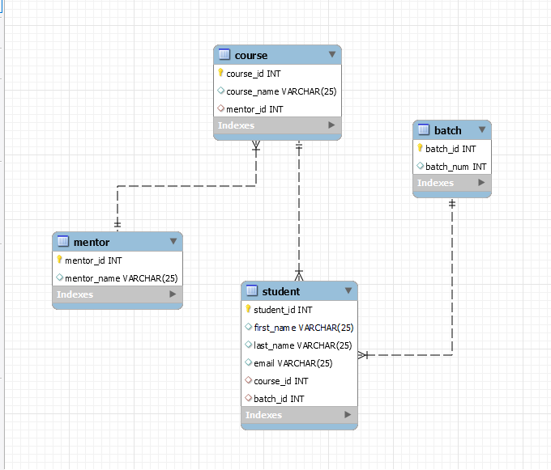
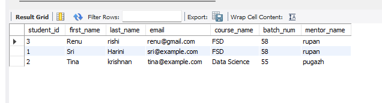

# Database Schema for Student Course Management

## Overview

This database schema is designed to manage information about students, the courses they are enrolled in, the batches they belong to, and the mentors responsible for each course. The schema includes four tables: `mentor`, `course`, `batch`, and `student`.

## Table Descriptions

1. **Mentor Table**: Stores information about mentors.
    - `mentor_id`: Primary key, unique identifier for each mentor.
    - `mentor_name`: Name of the mentor.

2. **Course Table**: Stores information about courses.
    - `course_id`: Primary key, unique identifier for each course.
    - `course_name`: Name of the course.
    - `mentor_id`: Foreign key, references `mentor(mentor_id)`.

3. **Batch Table**: Stores information about batches.
    - `batch_id`: Primary key, unique identifier for each batch.
    - `batch_num`: Batch number.

4. **Student Table**: Stores information about students.
    - `student_id`: Primary key, unique identifier for each student.
    - `first_name`: First name of the student.
    - `last_name`: Last name of the student.
    - `email`: Email address of the student.
    - `course_id`: Foreign key, references `course(course_id)`.
    - `batch_id`: Foreign key, references `batch(batch_id)`.

## SQL Script to Create the Tables

use dbdesign;

create table mentor(
 mentor_id int primary key,
 mentor_name VARCHAR(25)
 );
 
 create table course(
 course_id int primary key,
 course_name VARCHAR(25),
 mentor_id int,
 foreign key (mentor_id) references mentor(mentor_id)
 );
 
 create table batch(
 batch_id int primary key,
 batch_num int
 );
 
create table student(
 student_id int primary key,
 first_name VARCHAR(25),
 last_name VARCHAR(25),
 email VARCHAR(25),
 course_id int,
 batch_id int,
 foreign key (course_id) references course(course_id),
 foreign key (batch_id) references batch(batch_id))
 ;

